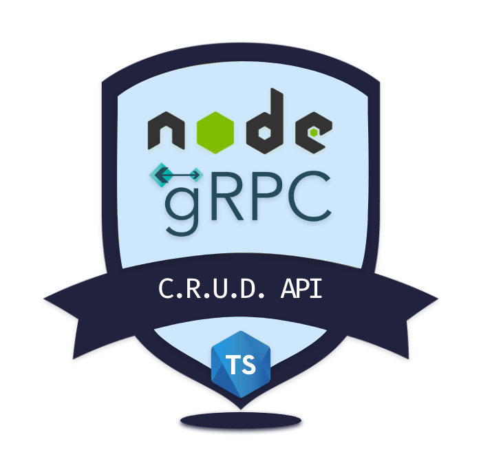

# gRPC C.R.U.D API

## In Node.JS with TypeScript

### Overview

The Following projects details a gRPC Node.JS C.R.U.D. API,
(i.e create, read, update and delete API), for a Blog app implemented in TypeScript.

## License

[MIT](LICENSE)
